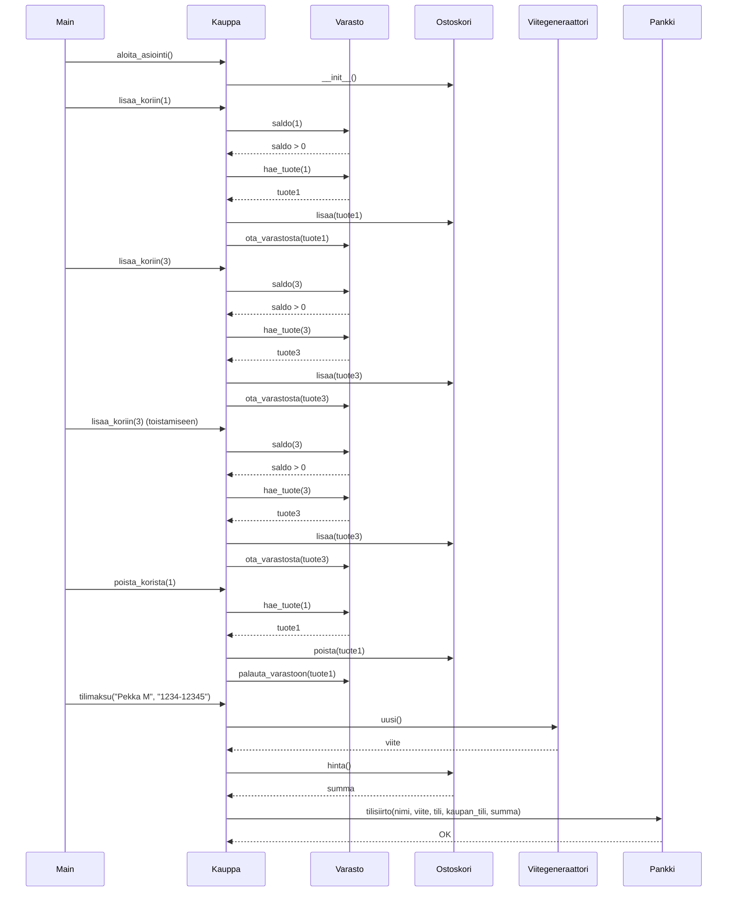

### Sekvenssikuvaaja

```mermaid
sequenceDiagram
    participant Main
    participant Kauppa
    participant Varasto
    participant Ostoskori
    participant Viitegeneraattori
    participant Pankki

    Main->>Kauppa: aloita_asiointi()
    Kauppa->>Ostoskori: __init__()

    Main->>Kauppa: lisaa_koriin(1)
    Kauppa->>Varasto: saldo(1)
    Varasto-->>Kauppa: saldo > 0
    Kauppa->>Varasto: hae_tuote(1)
    Varasto-->>Kauppa: tuote1
    Kauppa->>Ostoskori: lisaa(tuote1)
    Kauppa->>Varasto: ota_varastosta(tuote1)

    Main->>Kauppa: lisaa_koriin(3)
    Kauppa->>Varasto: saldo(3)
    Varasto-->>Kauppa: saldo > 0
    Kauppa->>Varasto: hae_tuote(3)
    Varasto-->>Kauppa: tuote3
    Kauppa->>Ostoskori: lisaa(tuote3)
    Kauppa->>Varasto: ota_varastosta(tuote3)

    Main->>Kauppa: lisaa_koriin(3) (toistamiseen)
    Kauppa->>Varasto: saldo(3)
    Varasto-->>Kauppa: saldo > 0
    Kauppa->>Varasto: hae_tuote(3)
    Varasto-->>Kauppa: tuote3
    Kauppa->>Ostoskori: lisaa(tuote3)
    Kauppa->>Varasto: ota_varastosta(tuote3)

    Main->>Kauppa: poista_korista(1)
    Kauppa->>Varasto: hae_tuote(1)
    Varasto-->>Kauppa: tuote1
    Kauppa->>Ostoskori: poista(tuote1)
    Kauppa->>Varasto: palauta_varastoon(tuote1)

    Main->>Kauppa: tilimaksu("Pekka M", "1234-12345")
    Kauppa->>Viitegeneraattori: uusi()
    Viitegeneraattori-->>Kauppa: viite
    Kauppa->>Ostoskori: hinta()
    Ostoskori-->>Kauppa: summa
    Kauppa->>Pankki: tilisiirto(nimi, viite, tili, kaupan_tili, summa)
    Pankki-->>Kauppa: OK
```

foo
bar